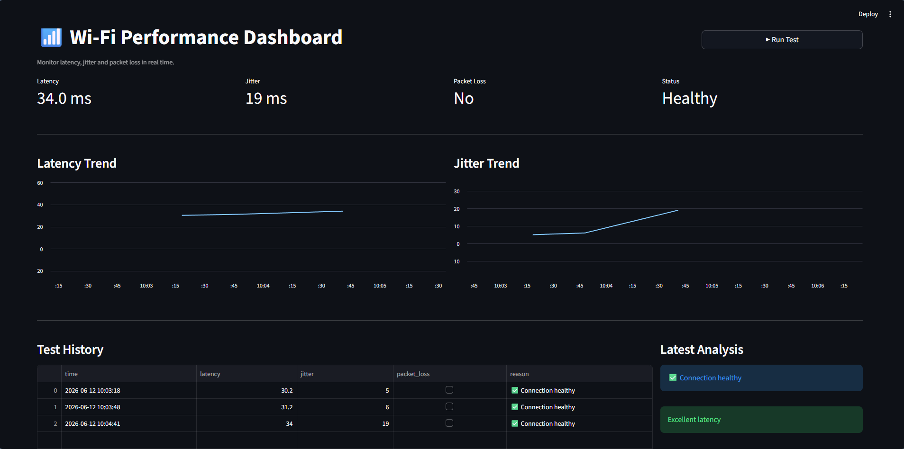

# 📶 Wi-Fi Performance Dashboard


A lightweight network monitoring dashboard built with Streamlit that helps diagnose Wi-Fi performance issues by tracking latency, jitter, and packet loss in real time.

The application performs ping tests against Google's public DNS server (`8.8.8.8`), visualizes network metrics, and provides simple explanations for common connectivity problems.

---

## 🚀 Features

* Real-time latency monitoring
* Jitter measurement
* Packet loss detection
* Historical performance logging
* Interactive charts
* Basic network issue diagnosis
* Cross-platform support (Windows, Linux, macOS)
* Simple and lightweight Streamlit interface

---

## 📸 Screenshots

### Dashboard Overview



> Screenshot to:
>
> `screenshots/dashboard.png`

---

## 📊 Metrics Explained

### Latency

Latency measures how long it takes for data to travel from your device to a remote server and back.

* Excellent: < 20 ms
* Good: 20–50 ms
* Acceptable: 50–100 ms
* Poor: > 100 ms

### Jitter

Jitter measures the variation in latency between packets.

* Excellent: < 10 ms
* Good: 10–30 ms
* Poor: > 40 ms

### Packet Loss

Packet loss occurs when data packets fail to reach their destination.

Even small amounts of packet loss can cause:

* Video call interruptions
* Online gaming lag
* Slow browsing
* Streaming issues

---

## 🛠 Installation

### 1. Clone the Repository

```bash
git clone https://github.com/YOUR_USERNAME/wifi-dashboard.git
cd wifi-dashboard
```

### 2. Create a Virtual Environment (Recommended)

Windows:

```bash
python -m venv venv
venv\Scripts\activate
```

Linux / macOS:

```bash
python3 -m venv venv
source venv/bin/activate
```

### 3. Install Dependencies

```bash
pip install -r requirements.txt
```

---

## ▶️ Run the Application

```bash
streamlit run app.py

python -m streamlit run app.py
```

The dashboard will open automatically in your browser.

---

## 📂 Project Structure

```text
wifi-dashboard/
│
├── app.py
├── requirements.txt
├── README.md
├── LICENSE
├── .gitignore
└── screenshots/
    └── dashboard.png
```

---

## 🔍 How It Works

The application:

1. Sends multiple ICMP ping requests to `8.8.8.8`
2. Extracts response times
3. Calculates:

   * Average latency
   * Jitter
   * Packet loss
4. Stores results in session memory
5. Displays historical trends using Streamlit charts

The dashboard then provides a basic diagnosis:

| Condition            | Diagnosis                      |
| -------------------- | ------------------------------ |
| Packet loss detected | Unstable Wi-Fi or interference |
| High jitter          | Network congestion             |
| High latency         | ISP or routing issues          |
| Normal metrics       | Healthy connection             |

---

## ⚡ Example Use Cases

* Home network troubleshooting
* Monitoring Wi-Fi quality
* Testing internet stability
* Diagnosing gaming lag
* Checking video conferencing performance
* Educational networking demonstrations

---

## 🔮 Future Improvements

* CSV export functionality
* Automatic scheduled testing
* Multiple target servers
* Network quality score
* Historical data persistence
* Dark mode customization
* Docker deployment
* ISP performance comparisons

---

## 🤝 Contributing

Contributions, suggestions, and improvements are welcome.

1. Fork the repository
2. Create a feature branch
3. Commit your changes
4. Open a pull request

---

## 📜 License

This project is licensed under the MIT License.

See the `LICENSE` file for details.

---

## 👤 Author

**2026 Quantum47Vision**

Built with Python, Pandas, and Streamlit.
